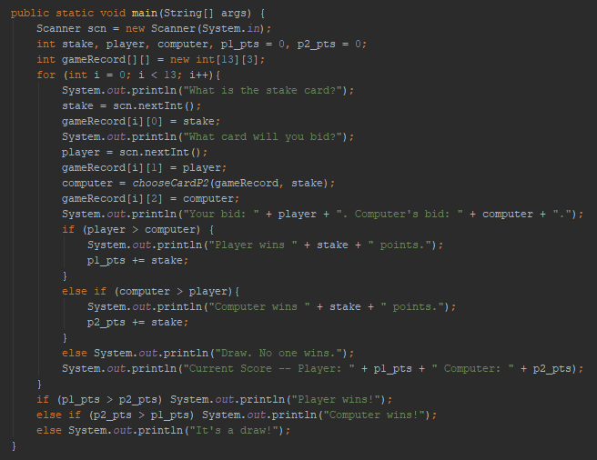

  
The entire game loop (apart from the GameLogic parts) at present. Allows a game to be played, using a text-based interface. No checking is done on the user's input yet.

---

  
This is what gameplay looks like now. This continues for 13 turns - regardless if the winner is set before the 13th turn.

---

  
Method for the computer to determine its move. It picks randomly from a list of cards it hasn't already used.

---

  
Method that can calcuate Player 1's current score. Further investigation is needed to find out why this is needed here. (right now I keep a running total of score)

---

  
Evaluates the 'gameHistory' and checks if it is valid. e.g. it is not valid if it's malformed, has an impossible number or if a number appears twice in the same column.

---

Current state: A primitive version of the game that is a starting point to help get to know the game and be able to build off of it.
What's next: Add the necessary validation on user input, improve the computer's decision making, start the GUI.