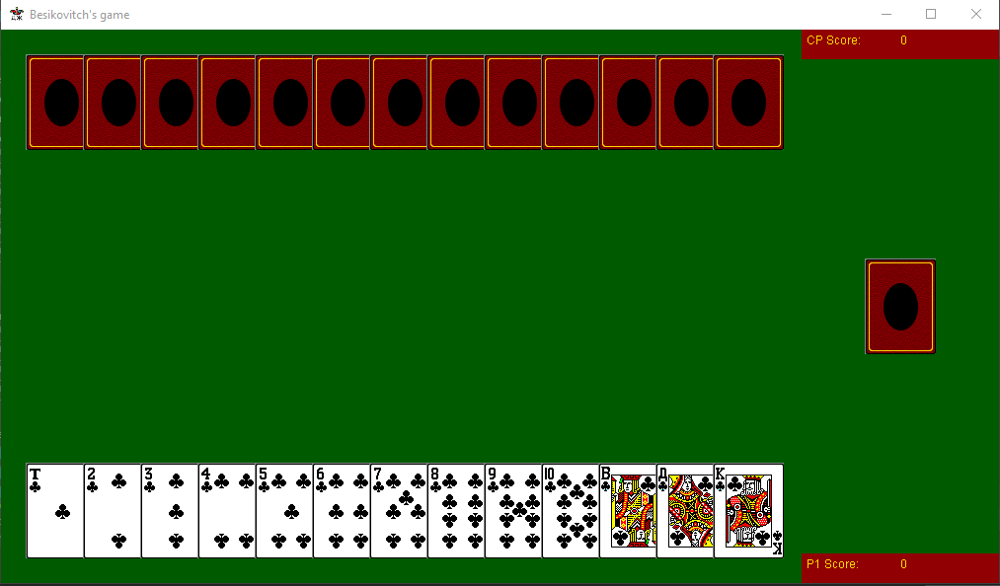
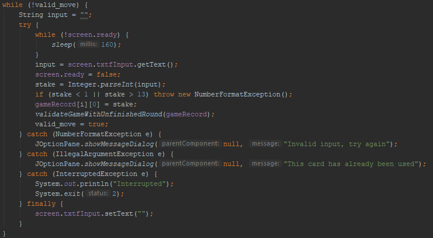
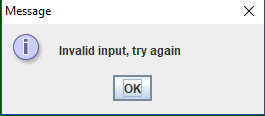
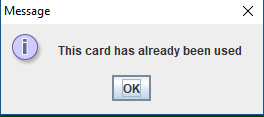
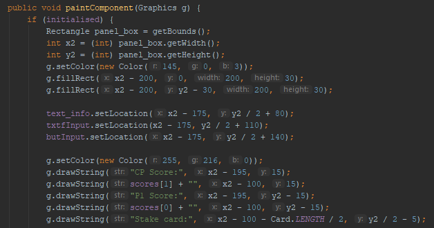
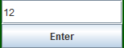
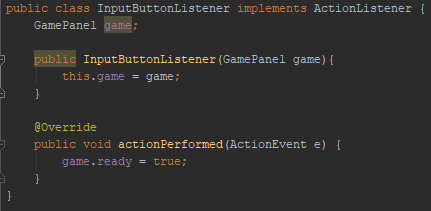
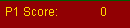
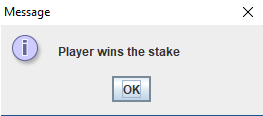
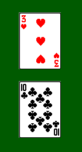

  
The game is now fully implemented  

Most of all invalid inputs are stopped.  
  

---

The game loop is now a lot more complex, as shown above. This shows part of the code that draws the screen:

---

There is a button and a text box. The button being pressed causes the input to be taken!

The button listener:

It doesn't do much by itself, but it sets a flag so the game knows there is an input to check.

---

Some more bits:  
  
The player's current score. It counts out when their bid wins the stake.  
  
And this is shown if you win the round.  
  
Each players card are put next to each other, symbolising the comparison...
Many changes were made to old code also, including the game logic, which seems better toward the end of a game than before.

---

Current state: A working version of the game, though there are probably bugs. The computer player's strategy still isn't great.
Next steps: Try and test and improve as much as possible.
