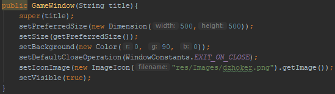

 break;")
The game loop itself didn't change very much but I added this line which ends the game if a player has already got more than half of all available points (1+2+...=91)
And it calls the validation method to make sure no invalid cards were played.

---

The GUI as of now...

---

Updated logic for the computer player. Now it picks with a strategy: Choose the card one higher than the stake card.
This strategy isn't very good if the opposition can figure out what it is doing

---

The checking for an invalid gameHistory actually works now, including checking for invalid moves.

---

Considerable time was spent making some graphics. The cards are from clipart-library.com (i.e. I didn't draw them) and edited to be look slightly Russian to try and give the game some character.

Also I made a small icon.

---

Current state: The game now operates fully in text-based mode (though incorrect input just crashes it). Game logic is improved. Work on the GUI is started.
What's next: Create the GUI. Improve game logic by having the computer player analyse the game history.