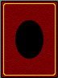
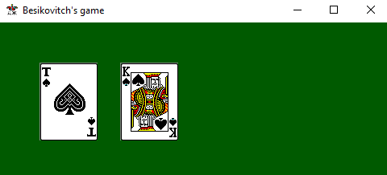
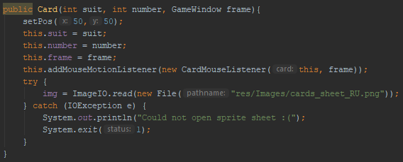
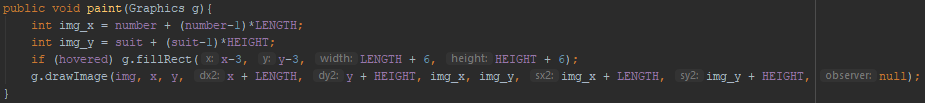
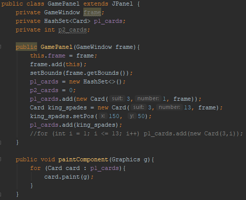
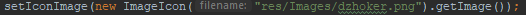
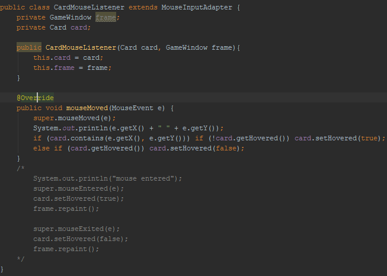

I made a sprite for the back of a card.

---

The game can now display cards! But they aren't in the right place.  
Here's the code for the cards:  

  
And code that calls it.  

---

Here's a line that sets the program icon:

---

A lot of time was spent trying to implement mouse listeners to let the user click on the cards. I am now exploring other options. (displaying cards but getting input by using textboxes and buttons or message dialogue)

---

The bottom part from yesterday still applies unfortunately
Current state: The game now operates fully in text-based mode (though incorrect input just crashes it). Game logic is improved. Work on the GUI is started.  
What's next: Create the GUI (the user interface part). Improve game logic by having the computer player analyse the game history.