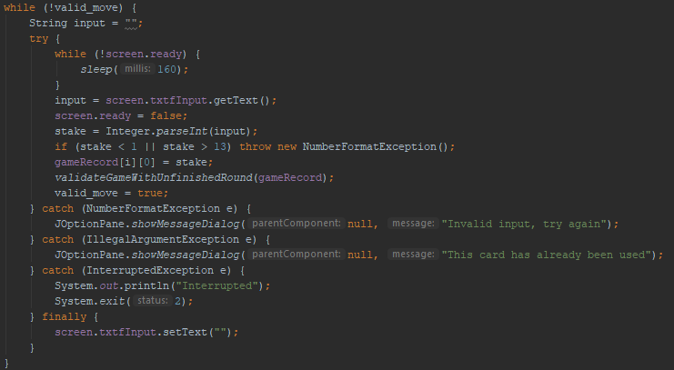
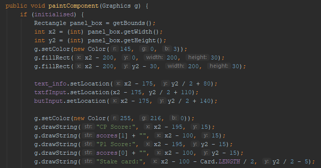

  
The game starts on this screen

---

  
Both players start with 0 points, of course.

---

Invalid inputs (such as out of range numbers or non-integers) are stopped, as are attempts to play a card that has already been played  

---

  
The stake card for the round is set as 9.

---

  
Both player's cards are shown together, and the winner is declared. Player played 11 and and Computer played 10, so the player wins the stake.

---

  
The player won 9 points from the round. The score even counts up to show the change.  

---

  
In the next round, the card you played is removed conveniently from the on screen set. The computer's cards go down by one too.

---

  
The game continues until the player or computer wins, or there is tie. This would be after all 13 rounds have been played (i.e. there are no more cards, or a player has won more than half of points)

---

Technical bits:
  
I quite enjoy this piece of code that makes the score count up, for how simple it is.
  
  
I am somewhat proud of the user input code - it is really quite complicated to work so I am proud that I got it to work but am still concerned it is not optimal.  
  
I am quite proud that I got a sprite sheet working properly - with it selecting the right part of the sheet to use at the right time.  
  
I am somewhat proud of this code - that draws everything to the screen - as well, as it is quite complicated (though it possibly could have been simpler)  
